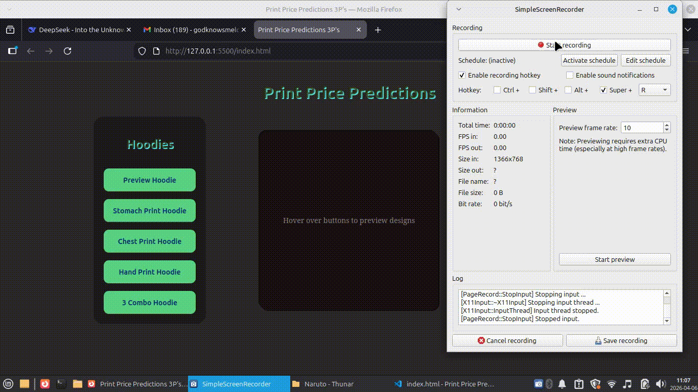

 ## Print Price Predictions (3Ps)

  A web tool that helps clothes printers set their pricing and customers calculate total print costs based on print area selection.

## Features

  - For Printers: Set custom pricing based on their own rates
  - For Customers: Select print areas via interactive buttons to see the total cost instantly
  - Built with HTML5, CSS3, and JavaScript

## How It Works

  1. Printer inputs their pricing preferences
  2. Customer clicks on different print area options
  3. Total cost updates in real-time

## Live Demo



## Technologies Used

- HTML5
- CSS3
- JavaScript (Vanilla)

## Setup

1. Clone the repository
   ```bash
   git clone https://github.com/Melcome1/print-price-predictions-3ps.git
Usage

  Printers: Set your base rates in the pricing panel
  Customers: Click on print area buttons to see estimated costs

Author
Melly
